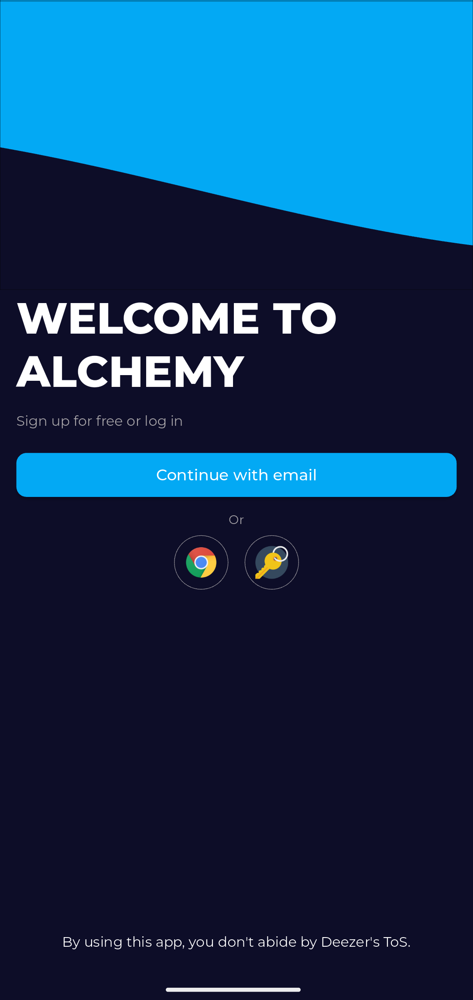
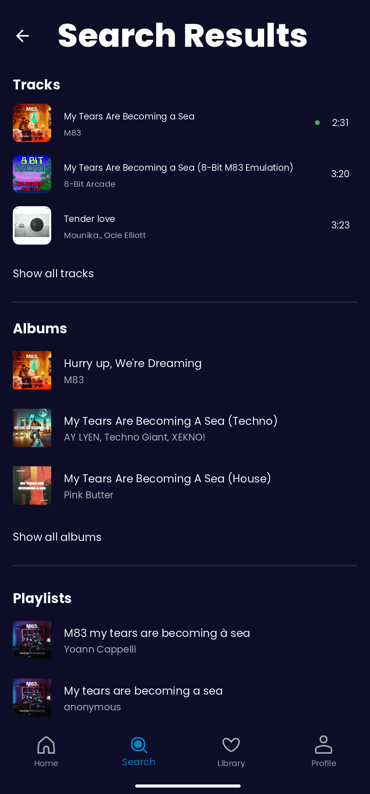
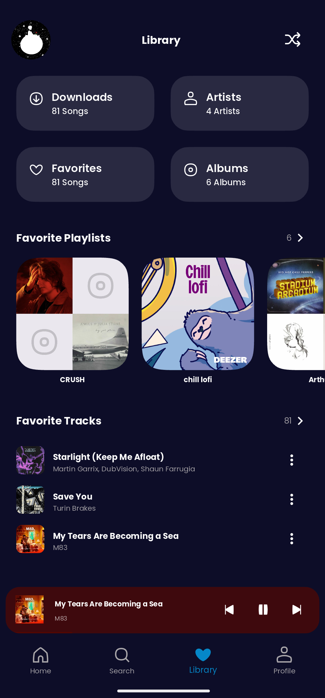
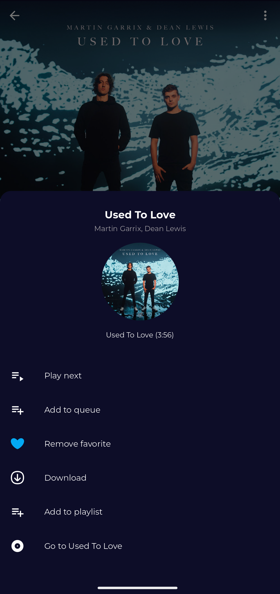
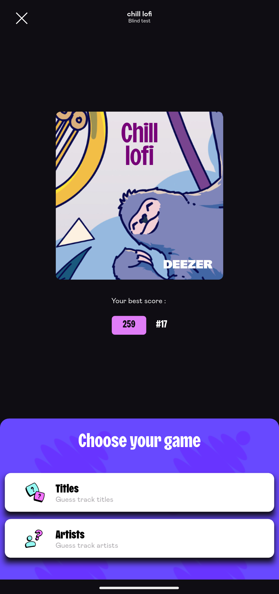
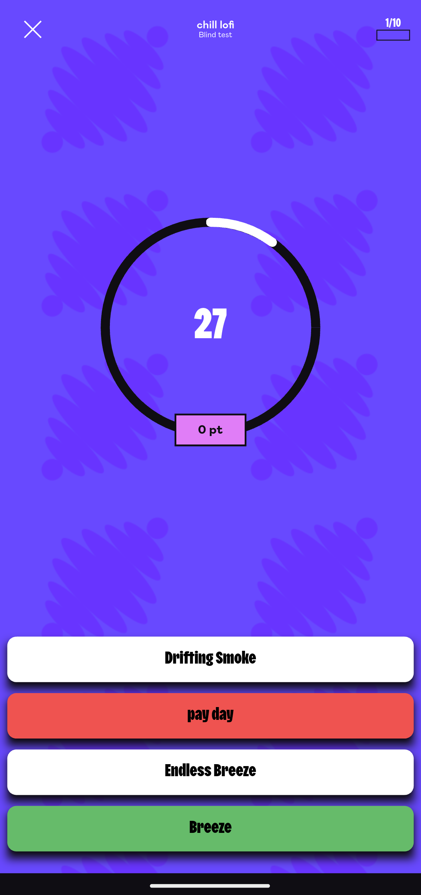
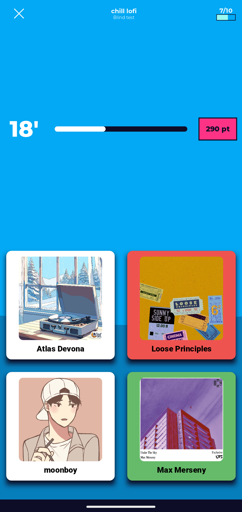
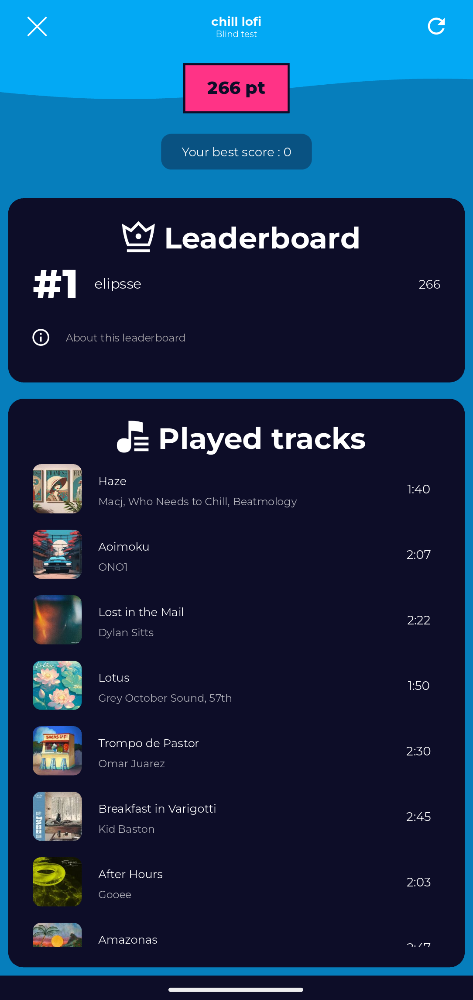
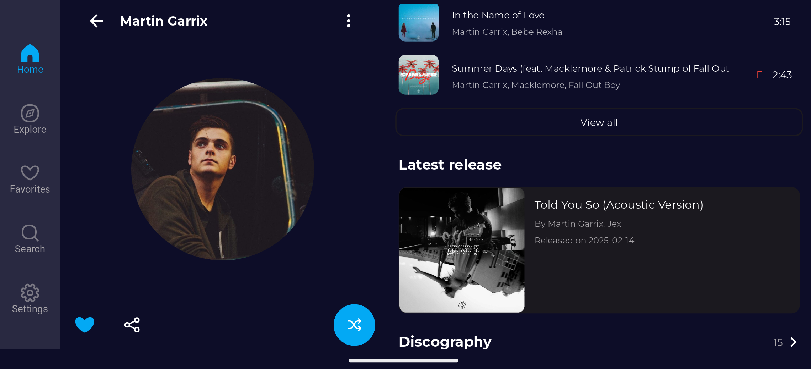
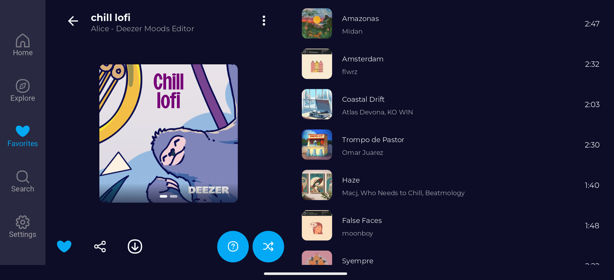

  

---

#### :rocket: Alchemy Features :
- Log in with an official Deezer account ;
- Explore the official Deezer catalog ;
- Play any track and skip freely ;
- Like, save and add your favorite tracks to your own playlists ;
- Sing along to the songs you love with synchronized lyrics ;
- Download tracks, playlists and albums for offline listening ;
- Challenge yourself with playlist-based blind tests ;
- Export downloaded tracks to local storage ;
- Import your playlists from Spotify ;
- Customize themes, accent colors and more.

This project originates from [ReFreezer](https://github.com/DJDoubleD/ReFreezer) by @DJDoubleD.  

## :hammer_and_wrench: Compile from source

Get Alchemy running: Follow [these instructions](./HOWTO.md) to compile it yourself. 

## :camera_flash: Screenshots

    
    
    
    
    
    
    
    

    
    
    
    

    
    

## :star2: Credits
- Built upon [ReFreezer](https://github.com/DJDoubleD/ReFreezer) by @DJDoubleD ;
- Lyrics provided by [LRCLIB](https://github.com/tranxuanthang/lrclib) by @tranxuanthang ;
- Design inspired by [Mallari Kishor's Spotify Redesign](https://www.behance.net/gallery/194018249/Spotify-App-Redesign).

## :building_construction: Upcoming features
- Continue the Search page UI refont ;
- Implement a profile edition screen ;
- Implement a song catcher ;
- Create notification settings ;
- Make dedicated podcast sections ;
- Add shows/episodes entries to the download database ;
- Prefetch lyrics for tracks in queue ;
- Make a create playlist from queue option ;
- Implement LyricFind API to get lyrics and translations ;
- Add lyrics to the downloaded tracks.

## :lady_beetle: Bugs
- Skipping tracks on the player screen is not as fluid as it used to be and can be choppy ;
- Some home tiles are not and will not be implemented (Concerts, Did you know, Original videos, ...)
- [Tell me !](https://github.com/PetitPrinc3/Deezer/issues)

## :balance_scale: Disclaimer & Legal

**Alchemy** was not developed for piracy, but educational and private use.
You are responsible for how you use **Alchemy**.
Using **Alchemy** may be illegal in your country.

**Alchemy** uses both Deezer's public and internal API's, but is not endorsed, certified or otherwise approved in any way by Deezer.

The Deezer brand and name is the registered trademark of its respective owner.

**Alchemy** has no partnership, sponsorship or endorsement with Deezer.

By using **Alchemy** you do not abide by Deezer's [Terms of Service](https://www.deezer.com/legal/cgu).
