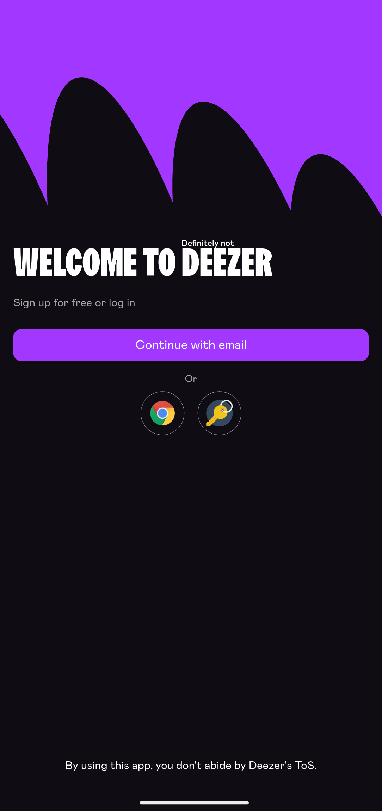

  

---

>[!CAUTION]
> The Deezer name, brand and affiliated designs are the registered trademark of **Deezer SA**  
> Providing an app using the Deezer branding theme and bypassing Deezer restrictions is illegal.  
> Therefore, there will be no apk releases or steps to compile published in this repository.  
> If you are a developper interested in taking on the project and providing the app, feel free to fork.  

This is definitely not Deezer.  
This is an app that uses both public and internal Deezer APIs to provide similar features.  

This repository originates from [ReFreezer](https://github.com/DJDoubleD/ReFreezer) by @DJDoubleD.  

## :camera_flash: Screenshots

    
    
    
    
    
    
    
    

    
    

## :star2: Features & changes

#### :lady_beetle: Bugs
- Lyrics are re-fetched from api each time the player is brought back. This is because the API does not include informations regarding the lyrics in the track model.

#### :building_construction: Upcoming features
- Turn the mod into a skin for the official refreezer app

#### :rocket: Definitely Not Deezer Features :
- Floating player bar with background color based on title artwork
- Deezer original icons & font
- Deezer original navigation menu (+ settings)
- Deezer like player screen
- Deezer like info menu
- Deezer like favorite screen (Offline : offline playlists and random offline tracks)
- Most Deezer like pages (artists, playlists, albums)
- Downloads are stored within the app storage (Android/data/package) and can be exported to local storage under settings with full tags
- Fixed lyrics support

## :balance_scale: Disclaimer & Legal

**Definitely not Deezer** was not developed for piracy, but educational and private use.
You are responsible for how you use **Definitely not Deezer**.

**Definitely not Deezer** uses both Deezer's public and internal API's, but is not endorsed, certified or otherwise approved in any way by Deezer.

The Deezer brand and name is the registered trademark of its respective owner.

**Definitely not Deezer** has no partnership, sponsorship or endorsement with Deezer.

By using **Definitely not Deezer** you do not abide by Deezer's [CGU](https://www.deezer.com/legal/cgu)
