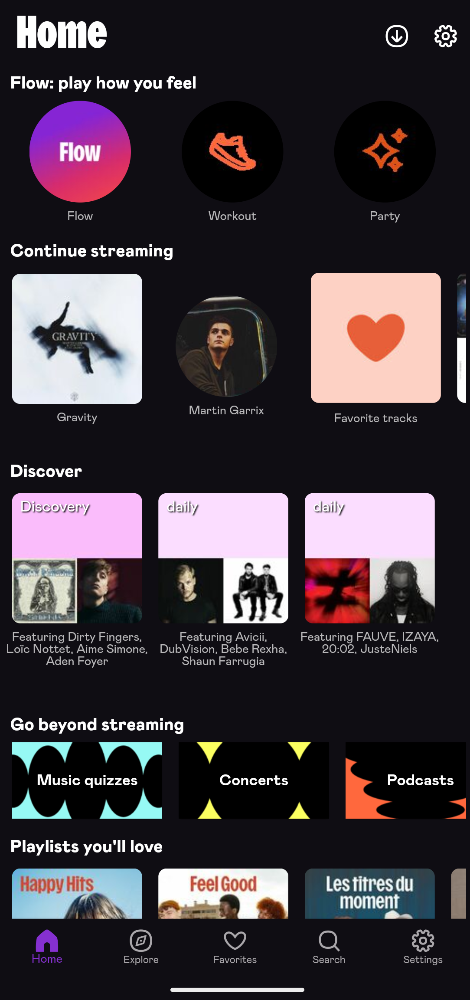
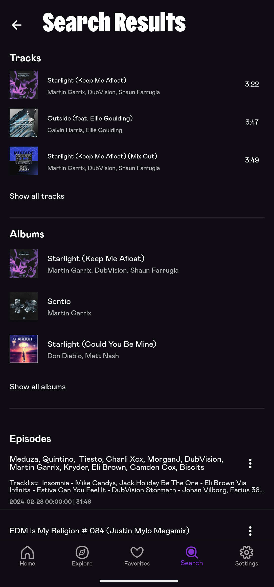
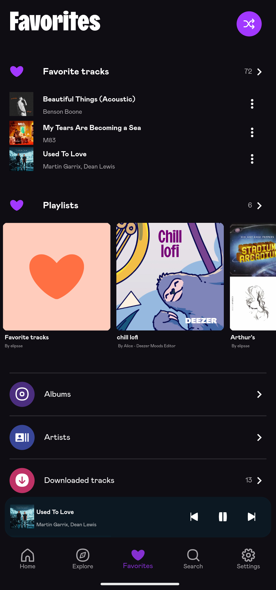
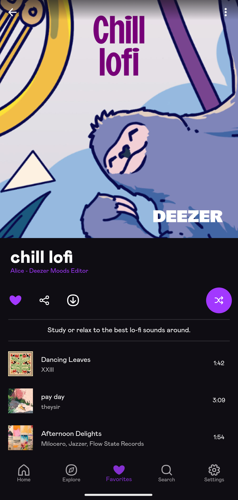
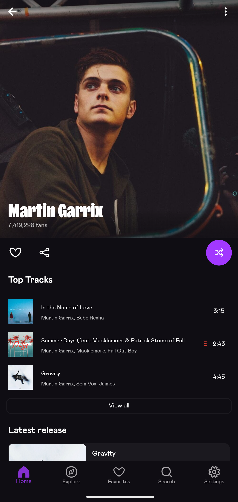
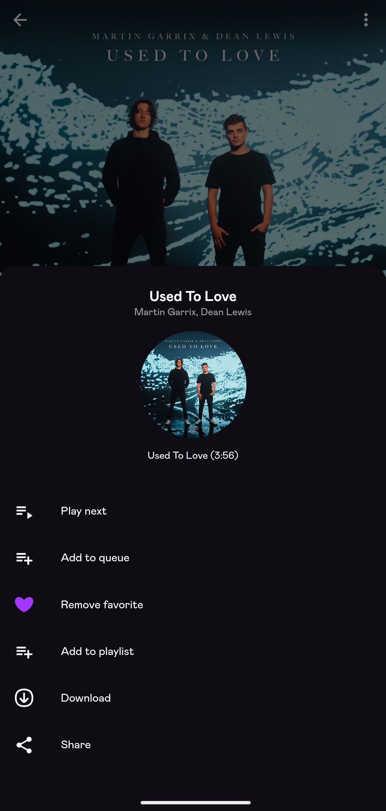
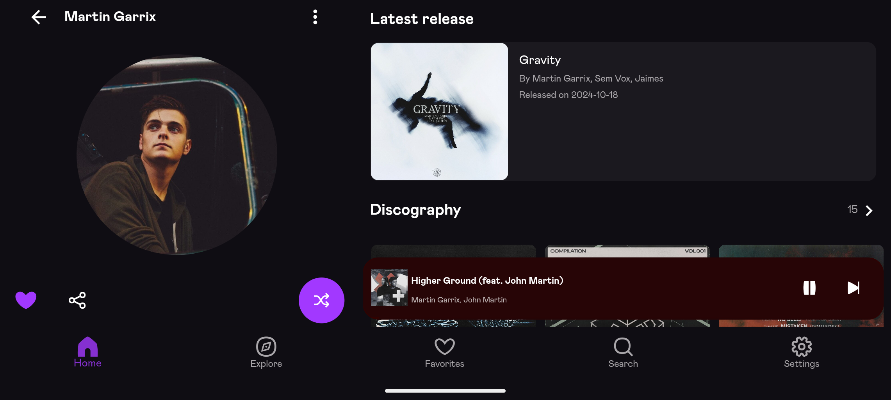
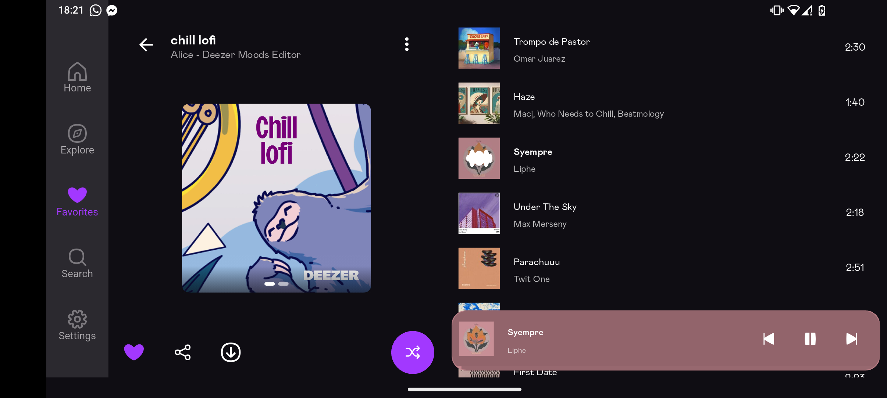

---

This is not a MOD of the official Deezer App.  
This is an alternative to the Deezer App providing premium features to free accounts using both public and internal Deezer APIs.  

This repo is based on [ReFreezer](https://github.com/DJDoubleD/ReFreezer) by @DJDoubleD.  
This branch focuses on the development of this app while the ReFreezer_Skin branch aims at turning this app into a skin for the official ReFreezer app.

> I am looking for contributors, feel free to reach out !  
> :mailbox: [e-mail me](mailto:gavrochebackups@gmail.com)  
> :space_invader: [Discord : @petitprinc3#1380](https://discordapp.com/users/PetitPrince#1380)

## :camera_flash: Screenshots

    
    
    
    
    
    
    

    
    

<b>Original ReFreezer App</b>

    
    
    
    
    
    
    
    
    
    

<b>Android Auto</b>

  

    
    
    
    
  

## :star2: Features & changes

### :lady_beetle: Bugs
- When the same track is added multiple times to queue, it does not display properly
- If queue is cleared and player bar is dismissed, it will not be brought back up if the user clicks back on the formerly playing track.
- Player bar does not always update its color on track tile tap or various other scenarios.

### :building_construction: Upcoming features
- Menu add inkwell tiles ontap visual effect
- Merge offline tracks and online tracks under tracks (same for playlists, albums, etc.)
- Caching information to avoid reloading every time (eg. favorites screen)
- Implement UpdateOfflinePlaylist() in downloadManager
- Turn the mod into a skin for the official refreezer app
- NavigationRail for landscape mode on left side of screen

### :rocket: MOD Features :
- Floating player bar with background color based on title artwork
- Deezer original icons
- Deezer font
- Deezer original navigation menu (+ settings)
- Deezer like player screen
- Deezer like info menu
- Deezer like favorite screen (Offline : offline playlists and random offline tracks)
- Most deezer pages (artists, playlists, albums)
- Downloads are stored within the app storage (Android/data/package) and can be exported to local storage under settings with full tags

### :rocket: ReFreezer Features :
- Restored all features of the old Freezer app, most notably:
  - Restored all login options
  - Restored Highest quality streaming and download options (premium account required, free accounts limited to MP3 128kbps)
- Support downloading to external storage (sdcard) for android 11 and up
- Restored homescreen and added new Flow & Mood smart playlist options
- Fixed Log-out (no need for restart anymore)
- Improved/fixed queue screen and queue handling (shuffle & rearranging)
- Updated lyrics screen to also support unsynced lyrics
- Some minor UI changes to better accomadate horizontal/tablet view
- Updated entire codebase to fully support latest flutter & dart SDK versions
- Updated to gradle version 8.5.1
- Removed included c libraries (openssl & opencrypto) and replaced them with custom native java implementation
- Replaced the included decryptor-jni c library with a custom native java implementation
- Implemented null-safety
- Removed the need of custom just_audio & audio_service plugin versions & refactored source code to use the latest version of the official plugins
- Multiple other fixes

## :pick: Compile from source

Follow the steps from [@DJDoubleD](https://github.com/DJDoubleD/refreezer).

## :balance_scale: Disclaimer & Legal

**ReFreezer** was not developed for piracy, but educational and private usage.
It may be illegal to use this in your country!
I will not be responsible for how you use **ReFreezer**.

**ReFreezer** uses both Deezer's public and internal API's, but is not endorsed, certified or otherwise approved in any way by Deezer.

The Deezer brand and name is the registered trademark of its respective owner.

**ReFreezer** has no partnership, sponsorship or endorsement with Deezer.

By using **ReFreezer** you agree to the following: <https://www.deezer.com/legal/cgu>
